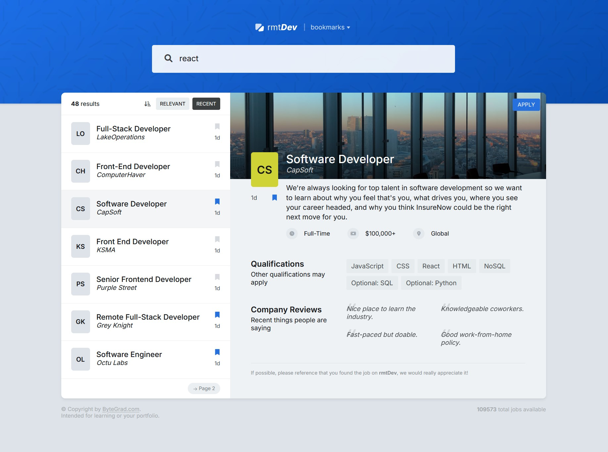
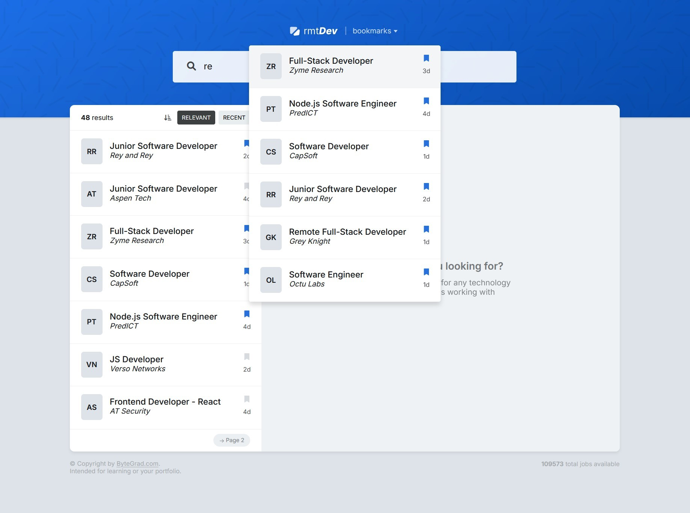

# IT Job offers application

##

## Example project written in React + TypeScript + Vite

Project created together with the ByteGrad's course.
Application is used for finding IT job offers which are provided by fake REST API.

Project uses:

- Web API (fetch)
- react components
- react hooks, e.g. useState, useEffect, useContext, useRef
- custom hooks, e.g. useDebounce to delay data fetching on typing in search input
- library, e.g. useQuery (query caching)

